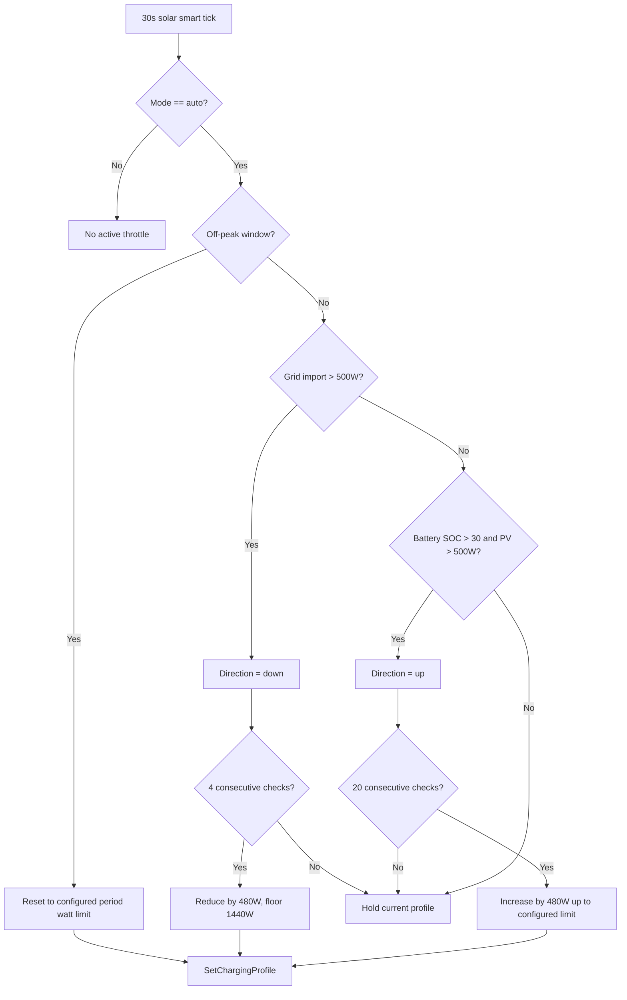

# OCPP-to-MQTT Bridge

A containerised Python service that bridges EV chargers using the **Open Charge Point Protocol (OCPP)** to the **docker-iot MQTT** broker. It acts as an OCPP Central System (CSMS) that charge points connect to via WebSocket, and translates all OCPP messages to/from MQTT topics.

Built on top of the [lbbrhzn/ocpp](https://github.com/lbbrhzn/ocpp) Home Assistant library, extracted and patched to run standalone without any Home Assistant dependencies.

## Purpose

This service allows you to integrate OCPP-compliant EV chargers into the docker-iot ecosystem:

- **OCPP → MQTT**: All charge point events (BootNotification, StatusNotification, MeterValues, StartTransaction, StopTransaction, etc.) are published to MQTT topics
- **MQTT → OCPP**: Send OCPP commands (RemoteStartTransaction, RemoteStopTransaction, Reset, UnlockConnector, etc.) via MQTT topics

## How It Works

### Architecture

```
┌─────────────────┐     WebSocket (OCPP)     ┌──────────────────────┐     MQTT      ┌──────────────┐
│  EV Charger      │ ◄─────────────────────► │  docker-ocpp-mqtt    │ ◄───────────► │  docker-iot   │
│  (Charge Point)  │                          │  (CSMS + Bridge)     │               │  MQTT Broker  │
└─────────────────┘                          └──────────────────────┘               └──────────────┘
```

1. **OCPP Central System**: The service runs a WebSocket server that EV chargers connect to using the standard OCPP 1.6 JSON protocol
2. **MQTT Bridge**: All OCPP messages are forwarded to structured MQTT topics
3. **Command Relay**: MQTT messages on command topics are translated back to OCPP operations and sent to the charger

### MQTT Topics

All topics are under the `ocpp/` prefix:

| Topic | Direction | Description |
|-------|-----------|-------------|
| `ocpp/{cp_id}/boot_notification` | OCPP → MQTT | Charger boot notification |
| `ocpp/{cp_id}/heartbeat` | OCPP → MQTT | Charger heartbeat |
| `ocpp/{cp_id}/status_notification` | OCPP → MQTT | Connector status changes |
| `ocpp/{cp_id}/meter_values` | OCPP → MQTT | Energy meter readings |
| `ocpp/{cp_id}/start_transaction` | OCPP → MQTT | Charging session started |
| `ocpp/{cp_id}/stop_transaction` | OCPP → MQTT | Charging session stopped |
| `ocpp/{cp_id}/authorize` | OCPP → MQTT | RFID/card authorization |
| `ocpp/{cp_id}/cmd` | MQTT → OCPP | Send commands to charger |
| `ocpp/{cp_id}/cmd_result` | OCPP → MQTT | Command execution results |

### Sending Commands

Publish a JSON message to `ocpp/{charge_point_id}/cmd`:

```json
{
  "action": "RemoteStartTransaction",
  "params": {
    "id_tag": "RFID_TAG_123",
    "connector_id": 1
  }
}
```

Supported actions: `RemoteStartTransaction`, `RemoteStopTransaction`, `Reset`, `UnlockConnector`, `GetConfiguration`, `ChangeConfiguration`, `ClearCache`, `TriggerMessage`

## Charging Logic

Each charge point (CP) has its own schedule config, persisted to DocumentDB. The UI provides a **STOP / AUTO / CHARGE NOW** toggle per CP.

### Schedule Modes

| Mode | Behavior |
|------|----------|
| 🛑 **STOP** | All charging blocked. `RemoteStopTransaction` sent to any active session. New `Authorize` requests rejected. |
| ⏱ **AUTO** | Time-of-day schedule with configurable periods. Each period defines a watt limit for a starting hour. The active period's `limit_watts` determines whether charging is allowed (limit > 0 = allowed). |
| ⚡ **CHARGE NOW** | Full power — no restrictions. Always allows charging. |

### AUTO Mode - Periods

Periods are defined as `{start_hour, limit_watts}` pairs, sorted by hour. The active period is the one with the largest `start_hour <= current_hour`. If `limit_watts` is 0, charging is blocked during that window. The schedule repeats daily.

```
Example:
  00:00 → 4800W  (overnight — full power)
  16:00 → 1440W  (peak — reduced)
```

### Solar Smart (optional, AUTO mode only)

When `solar_smart: true` and mode is AUTO, the bridge dynamically throttles charging power based on live solar/grid telemetry from ESY Sunhomes (MQTT):

- **Off-Peak window** (`off_peak_start_hour` to `off_peak_end_hour`): Resets to the configured period rate — no throttling. Grid import is allowed during off-peak.
- **Peak window**: Throttles down when grid import exceeds 500W. Ramps up slowly (10 min of sustained export required) with PV ≥ 500W and battery SOC > 30%.
- Ramp step: 480W per check. Floor: 1440W minimum.
- Throttle is per-CP and communicated via OCPP `SetChargingProfile` (TxDefaultProfile, Recurring+Daily).

### Decision Flow (Mermaid)



The OCPP scheduler decides the base limit by active time-of-day period, while the solar-smart loop nudges that limit up or down according to live grid import/export and battery health.

### Data Sources (Web UI)

| Card | Source |
|------|--------|
| **Charging Power** | Live `Power.Active.Import` from OCPP MeterValues per connector |
| **Grid Export** | ESY Sunhomes MQTT telemetry (`gridExport`) |
| **Battery SOC** | ESY Sunhomes MQTT telemetry (`batterySoc`) |
| **Power Distribution** | Bar chart: PV, Grid Out, Grid In, Charging (total) |

## Configuration

All settings via environment variables:

| Variable | Default | Description |
|----------|---------|-------------|
| `OCPP_HOST` | `0.0.0.0` | CSMS WebSocket listen address |
| `OCPP_PORT` | `9000` | CSMS WebSocket listen port |
| `OCPP_WS_PATH` | `/{charge_point_id}` | WebSocket path pattern |
| `MQTT_BROKER` | `docker-iot_server` | MQTT broker hostname |
| `MQTT_PORT` | `8883` | MQTT broker port |
| `MQTT_THING_NAME` | `gormantec-ocpp-bridge` | MQTT client identifier |

## Building

```bash
# Build and push via IoT CLI
npm run build:image-force

# Or manually
docker build -t ghcr.io/gormantec/docker-ocpp-mqtt:latest .
docker push ghcr.io/gormantec/docker-ocpp-mqtt:latest
```
